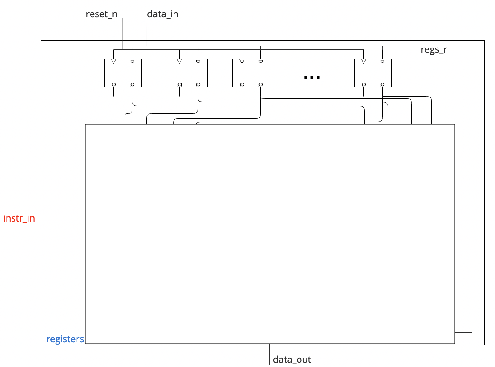
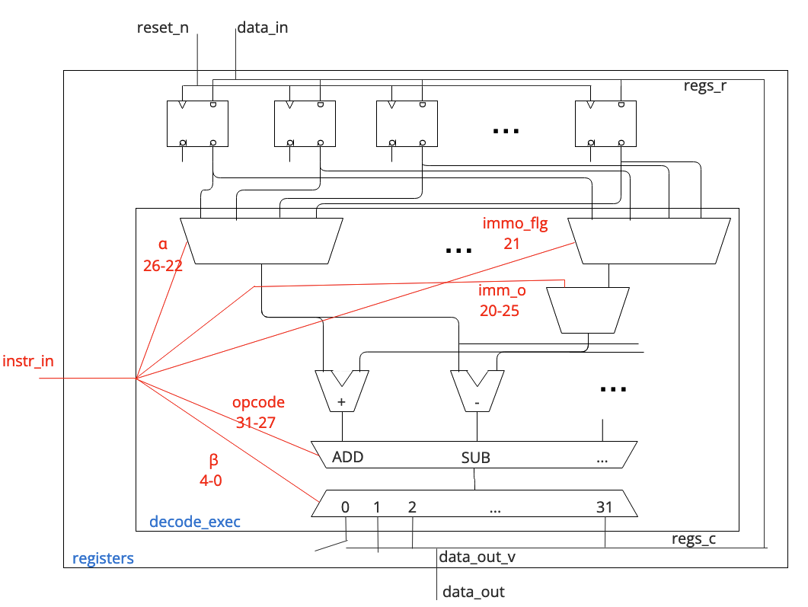
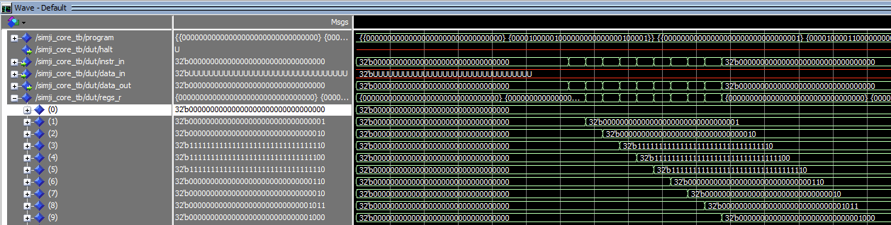

# Introduction
Le CPU *simji* est un CPU capable de réaliser différente opération, dans mon cas j'ai pu réaliser :

1. L'adition
2. La soustraction
3. La multiplication
4. La division 
5. Le *'and'* 
6. Le *'or'* 
7. Le *'xor'* 

Il est important de prendre compte que les opérations se font avec des registres signés, soit les valeurs sont sur 16bits ce qui nous permet de réaliser des calculs avec des valeurs allant de *-65536* à *65536*.

# Travail réalisé

## L'entité
```vhdl 
entity simji_core is
  port (
    reset_n        : in  std_logic;
    clk            : in  std_logic;
    halt           : out std_logic;

    instr_in       : in  std_logic_vector(31 downto 0);

    data_in        : in  std_logic_vector(31 downto 0);
    data_out       : out std_logic_vector(31 downto 0)
  );
end entity;
```

1. `reset_n` pour reset les données, il est asynchrone donc immédiat.
2. `clk` pour l'horloge
3. `data_in` pour les données entrante
4. `data_out` pour les données sortante

## Les signaux 
```vhdl
architecture archi of simji_core is
  type regs_t is array(0 to 31) of std_logic_vector(31 downto 0);
  signal regs_r, regs_c : regs_t;
  signal halt_r, halt_c : std_logic;
begin
```

1. `regs_r`, un signal correspondant à une variable tampon pour les données entrantes, donc au début est égale à `data_in`
2. `regs_c`, un signal correspondant à une variable tampon pour les données sortantes, donc à la fin du process `decode_exec` donné à `data_out`
   

## Les process
### registers



**2 fonctionalité :**

1. Le *process* register permet de rénitialiser les valeurs d'entrés de manière **asynchrone**, si *reset_n* vaut `1` le programme recommence avec le registre d'entrée initialisée
2. A chaques coups de clock, la valeurs du registre d'entrée `regs_r` prend la valeur du registre de sortie `regs_c`

```vhdl
registers: process(reset_n, clk)
  begin
    if reset_n='0' then
      for i in 0 to 31 loop
        regs_r(i) <= (others=> '0');
      end loop;
      halt_r <= '0';
    elsif rising_edge(clk) then
      regs_r  <= regs_c;
      halt_r  <= halt_c;
    end if;
  end process;
```

### decode_exec



Le process *decode_exec* est la partie principale du code. C'est ici que les opérations seront réalisé. 

Le registre `instr_in` indique quoi faire, ce registre sur *32bits* est distribué au différent registre de couleur rouge sur la *figure 2*. \
La répartition de ce registre correspond au tableau suivant :

Variable | Registre de `instr_in` | Informations
---|---|----------------------
$\beta$ | 0...4 | Permet de choisir le registre de sortie qui sera utilisé pour le résultat l'opération: regs_c($\beta$)
$\alpha$ | 22...26 | Permet de choisir le registre d'entré qui sera utilisé pour l'opération: regs_r($\alpha$)
`reg_o` | 9...5 | Permet de réaliser le calcul avec un des registres de regs_r(), soit la valeur d'une opération précédente ou de `data_in` si c'est la première itération 
`imm_o` | 5...20 | Permet de réaliser le calcul avec une valeur choisis dans `instr_in`
`immo_flg` | 21 | Si `immo_flg` vaut 1, l'opération se fait entre regs_r($\alpha$) et `imm_o`, sinon entre regs_r($\alpha$) et `reg_o`
`opcode` | 27...31 | Permet de choisir le type d'opération à réaliser, exemple *00001* pour l'addition


En s'aident du schéma de la *figure 2* et du code ci-dessous, on peut comprendre :

1. On a le choix pour les registres qui devront subirent l'opération :
   - On a le choix de prendre le registres d'entré que l'on souhaite grâce à $\alpha$ (de 0 à 31)
   - Si c'est la première itération, `regs_r($\alpha$) contient un des registres donnée en entrée (regs_r($\alpha$)=regs_v($\beta$))
   - Si ce n'est pas la première itération, regs_r($\alpha$) contient un des registres donnée en entrée ou un des registres obtenus en sortie d'opération si le registre d'entrée à été écrasé. (regs_r($\alpha$)=regs_v($\beta$))
   - Si `immo_flg` vaut 1, l'opération ce fait entre regs_v($\beta$) et `imm_o`
   - Si `immo_flg` vaut 0, l'opération ce fait entre regs_v($\beta$) et `reg_o`


2. On a le choix pour l'opération :
   - Adition &rarr; `OPCODE_ADD = "00001"`
   - Soustraction &rarr; `OPCODE_SUB = "00010"`
   - Multiplication &rarr; `OPCODE_MUL = "00011"`
   - Division &rarr; `OPCODE_DIV = "00100"`
   - and &rarr; `OPCODE_AND = "00101"`
   - or &rarr; `OPCODE_OR = "00110"`
   - xor  &rarr; `OPCODE_XOR = "00111"`


3. On a le choix où placer le registre de sortie :
   - regs_c($\beta$) = regs_v($\beta$), grâce à $\beta$ (de 1 à 31)


```vhdl
decode_exec: process(data_in, instr_in, regs_r, halt_r)
    constant OPCODE_ADD        : std_logic_vector(4 downto 0) := "00001";
    constant OPCODE_SUB        : std_logic_vector(4 downto 0) := "00010";
    constant OPCODE_MUL        : std_logic_vector(4 downto 0) := "00011";
    constant OPCODE_DIV        : std_logic_vector(4 downto 0) := "00100";
    constant OPCODE_AND        : std_logic_vector(4 downto 0) := "00101";
    constant OPCODE_OR         : std_logic_vector(4 downto 0) := "00110";
    constant OPCODE_XOR        : std_logic_vector(4 downto 0) := "00111";

    variable opcode        : std_logic_vector(4 downto 0);
    variable alpha         : integer range 0 to 31;
    variable beta          : integer range 0 to 31;
    variable imm_o         : signed(15 downto 0);
    variable reg_o         : integer range 0 to 31;
    variable o             : std_logic_vector(31 downto 0);
    variable immo_flag     : std_logic;
    variable regs_v        : regs_t;
    variable halt_v        : std_logic;
    variable instr_v       : std_logic_vector(31 downto 0);
	  variable data_out_v    : std_logic_vector(31 downto 0);

  begin
	  -- variables tampon
    instr_v    := instr_in;
    regs_v     := regs_r;
    halt_v     := halt_r;

    -- init variables
	  data_out_v := (others=>'0');
    opcode        := "00000";
    immo_flag     := '0';
    imm_o         := (others=>'0');
    reg_o         := 0;
    alpha         := 0;
	  beta          := 0;

	  -- set variables
    opcode        :=                     instr_v(31 downto 27);
    alpha         := to_integer(unsigned(instr_v(26 downto 22)));
    beta          := to_integer(unsigned(instr_v( 4 downto  0)));
    immo_flag     :=                     instr_v(21);
    imm_o         :=              signed(instr_v(20 downto 5));
    reg_o         := to_integer(unsigned(instr_v(9 downto  5)));
	  regs_v(beta) := data_in;
    
    if immo_flag='1' then
      o := std_logic_vector(resize(imm_o,32));
    else
      o := regs_v(reg_o);
    end if;

    case opcode is
      when OPCODE_ADD  =>
	      report "OPCODE_ADD"; 
        regs_v(beta) := std_logic_vector(signed(regs_v(alpha)) + signed(o));
      when OPCODE_SUB  =>
        report "OPCODE_SUB"; 
        regs_v(beta) := std_logic_vector(signed(regs_v(alpha)) - signed(o));
      when OPCODE_MUL  =>
	      report "OPCODE_MUL"; 
        regs_v(beta) := std_logic_vector(resize(signed(regs_v(alpha)) * signed(o),32));
      when OPCODE_DIV  =>
	      report "OPCODE_DIV"; 
        regs_v(beta) := std_logic_vector(resize(signe(regs_v(alpha)) / signed(o),32));
      when OPCODE_AND  =>
	      report "OPCODE_AND"; 
        regs_v(beta) := regs_v(alpha) and o;
      when OPCODE_OR  =>
	      report "OPCODE_OR"; 
        regs_v(beta) := regs_v(alpha)  or o;
      when OPCODE_XOR  =>
	      report "OPCODE_XOR"; 
        regs_v(beta) := regs_v(alpha) xor o;
      when others =>
        report "ERROR: Unknow operator";
    end case;
	 
   	regs_v(0) := (others =>'0');
	  data_out_v  := regs_v(beta);

    regs_c    <= regs_v;
    halt_c    <= halt_v;
    data_out  <= data_out_v;
  end process;
```

## La simulation

La simulation à été réalisé avec différentes opérations à la suite, mais la première valeur d'entré vaut *0* comme la simulation ne fonctionne pas si je donne une valeurs différente de *0* à `data_in`. \
Pour les opération suivantes elles ont étaient réalisé avec le résultat de l'opération précédente et `imm_o`, donc `immo_flg` vaut 1.

  1. Opération 1 - *Addition* : *0+1=1*
   
      N°bits         | 31  | 30 | 29 | 28 | 27 | 26 | 25 | 24 | 23 | 22  | 21 | 20 | 19 | 18 | 17 | 16 | 15 | 14 | 13 | 12 | 11 | 10 | 9 | 8 | 7 | 6 | 5 | 4 | 3 | 2 | 1 | 0
      ------------------------------------------------------------|-----|----|----|----|----|----|----|----|----|-----|----|----|----|----|----|----|----|----|----|----|----|----|---|---|---|---|---|---|---|---|---|---
      `instr_in`     | 0   | 0  | 0  | 0  | 1  | 0  | 0  | 0  | 0  | 0   | 1  | 0  | 0  | 0  | 0  | 0  | 0  | 0  | 0  | 0  | 0  | 0  | 0 | 0 | 0 | 0 | 1 | 0 | 0 | 0 | 0 | 1 

     - `opcode` = *0b00001* &rarr; Addition
     - `alpha` = *0b00000* &rarr; `regs_r(0)` = 0
     - `immo_flg` = *0b1* 
     - `imm_o` = *0b0000000000000001* = 1
     - `beta` = *0b00001* &rarr; `regs_c(1)` = *0x00000001*


  2. Opération 2 - *Addition* : *1+1=2*
   
      N°bits         | 31  | 30 | 29 | 28 | 27 | 26 | 25 | 24 | 23 | 22  | 21 | 20 | 19 | 18 | 17 | 16 | 15 | 14 | 13 | 12 | 11 | 10 | 9 | 8 | 7 | 6 | 5 | 4 | 3 | 2 | 1 | 0
      ------------------------------------------------------------|-----|----|----|----|----|----|----|----|----|-----|----|----|----|----|----|----|----|----|----|----|----|----|---|---|---|---|---|---|---|---|---|---
      `instr_in`     | 0   | 0  | 0  | 0  | 1  | 0  | 0  | 0  | 0  | 1   | 1  | 0  | 0  | 0  | 0  | 0  | 0  | 0  | 0  | 0  | 0  | 0  | 0 | 0 | 0 | 0 | 1 | 0 | 0 | 0 | 1 | 0 

     - `opcode` = *0b00001* &rarr; Addition
     - `alpha` = *0b00001* &rarr; `regs_r(1)` = 1
     - `immo_flg` = *0b1* 
     - `imm_o` = *0b0000000000000001* = 1
     - `beta` = *0b00010* &rarr; `regs_c(2)` = *0x00000002*


  3. Opération 3 - *Soustraction* : *2-4=-2*
   
      N°bits         | 31  | 30 | 29 | 28 | 27 | 26 | 25 | 24 | 23 | 22  | 21 | 20 | 19 | 18 | 17 | 16 | 15 | 14 | 13 | 12 | 11 | 10 | 9 | 8 | 7 | 6 | 5 | 4 | 3 | 2 | 1 | 0
      ------------------------------------------------------------|-----|----|----|----|----|----|----|----|----|-----|----|----|----|----|----|----|----|----|----|----|----|----|---|---|---|---|---|---|---|---|---|---
      `instr_in`     | 0   | 0  | 0  | 1  | 0  | 0  | 0  | 0  | 1  | 0   | 1  | 0  | 0  | 0  | 0  | 0  | 0  | 0  | 0  | 0  | 0  | 0  | 0 | 0 | 1 | 0 | 0 | 0 | 0 | 0 | 1 | 1 

     - `opcode` = *0b00010* &rarr; Soustraction
     - `alpha` = *0b00010* &rarr; `regs_r(2)` = 2
     - `immo_flg` = *0b1* 
     - `imm_o` = *0b0000000000000001* = 1
     - `beta` = *0b00011* &rarr; `regs_c(3)` = *0xffffffe*


  4. Opération 4 - *Multiplication* : *-2x2=-4*
   
      N°bits         | 31  | 30 | 29 | 28 | 27 | 26 | 25 | 24 | 23 | 22  | 21 | 20 | 19 | 18 | 17 | 16 | 15 | 14 | 13 | 12 | 11 | 10 | 9 | 8 | 7 | 6 | 5 | 4 | 3 | 2 | 1 | 0
      ------------------------------------------------------------|-----|----|----|----|----|----|----|----|----|-----|----|----|----|----|----|----|----|----|----|----|----|----|---|---|---|---|---|---|---|---|---|---
      `instr_in`     | 0   | 0  | 0  | 1  | 1  | 0  | 0  | 0  | 1  | 1   | 1  | 0  | 0  | 0  | 0  | 0  | 0  | 0  | 0  | 0  | 0  | 0  | 0 | 0 | 0 | 1 | 0 | 0 | 0 | 1 | 0 | 0 

     - `opcode` = *0b00011* &rarr; Multiplication
     - `alpha` = *0b00011* &rarr; `regs_r(3)` = -2
     - `immo_flg` = *0b1* 
     - `imm_o` = *0b0000000000000010* = 2
     - `beta` = *0b00100* &rarr; `regs_c(4)` = *0xffffffc*


  5. Opération 5 - *Division* : *-4/2=-2*
   
      N°bits         | 31  | 30 | 29 | 28 | 27 | 26 | 25 | 24 | 23 | 22  | 21 | 20 | 19 | 18 | 17 | 16 | 15 | 14 | 13 | 12 | 11 | 10 | 9 | 8 | 7 | 6 | 5 | 4 | 3 | 2 | 1 | 0
      ------------------------------------------------------------|-----|----|----|----|----|----|----|----|----|-----|----|----|----|----|----|----|----|----|----|----|----|----|---|---|---|---|---|---|---|---|---|---
      `instr_in`     | 0   | 0  | 1  | 0  | 0  | 0  | 0  | 1  | 0  | 0   | 1  | 0  | 0  | 0  | 0  | 0  | 0  | 0  | 0  | 0  | 0  | 0  | 0 | 0 | 0 | 1 | 0 | 0 | 0 | 1 | 0 | 1 

     - `opcode` = *0b00100* &rarr; Division
     - `alpha` = *0b00100* &rarr; `regs_r(4)` = -4
     - `immo_flg` = *0b1* 
     - `imm_o` = *0b0000000000000010* = 2
     - `beta` = *0b00101* &rarr; `regs_c(5)` = *0xffffffe*


  6. Opération 6 - *Multiplication* : *-2x-3=6*
   
      N°bits         | 31  | 30 | 29 | 28 | 27 | 26 | 25 | 24 | 23 | 22  | 21 | 20 | 19 | 18 | 17 | 16 | 15 | 14 | 13 | 12 | 11 | 10 | 9 | 8 | 7 | 6 | 5 | 4 | 3 | 2 | 1 | 0
      ------------------------------------------------------------|-----|----|----|----|----|----|----|----|----|-----|----|----|----|----|----|----|----|----|----|----|----|----|---|---|---|---|---|---|---|---|---|---
      `instr_in`     | 0   | 0  | 0  | 1  | 1  | 0  | 0  | 1  | 0  | 1   | 1  | 1  | 1  | 1  | 1  | 1  | 1  | 1  | 1  | 1  | 1  | 1  | 1 | 1 | 1 | 0 | 1 | 0 | 0 | 1 | 1 | 0 

     - `opcode` = *0b00011* &rarr; Multiplication
     - `alpha` = *0b00101* &rarr; `regs_r(5)` = -2
     - `immo_flg` = *0b1* 
     - `imm_o` = *0b1111111111111101* = -3
     - `beta` = *0b00110* &rarr; `regs_c(6)` = *0x00000006*


  7. Opération 7 - *and* : *0x00000006 and 0x00000002 = 0x00000002*
   
      N°bits         | 31  | 30 | 29 | 28 | 27 | 26 | 25 | 24 | 23 | 22  | 21 | 20 | 19 | 18 | 17 | 16 | 15 | 14 | 13 | 12 | 11 | 10 | 9 | 8 | 7 | 6 | 5 | 4 | 3 | 2 | 1 | 0
      ------------------------------------------------------------|-----|----|----|----|----|----|----|----|----|-----|----|----|----|----|----|----|----|----|----|----|----|----|---|---|---|---|---|---|---|---|---|---
      `instr_in`     | 0   | 0  | 1  | 0  | 1  | 0  | 0  | 1  | 1  | 0   | 1  | 0  | 0  | 0  | 0  | 0  | 0  | 0  | 0  | 0  | 0  | 0  | 0 | 0 | 0 | 1 | 0 | 0 | 0 | 1 | 1 | 1 

     - `opcode` = *0b00101* &rarr; and
     - `alpha` = *0b00110* &rarr; `regs_r(6)` = *0x00000006*
     - `immo_flg` = *0b1* 
     - `imm_o` = *0b0000000000000010* = *0x00000002*
     - `beta` = *0b00111* &rarr; `regs_c(7)` = *0x00000002*


  8. Opération 8 - *or* : *0x00000002 or 0x0000000b = 0x0000000b*
   
      N°bits         | 31  | 30 | 29 | 28 | 27 | 26 | 25 | 24 | 23 | 22  | 21 | 20 | 19 | 18 | 17 | 16 | 15 | 14 | 13 | 12 | 11 | 10 | 9 | 8 | 7 | 6 | 5 | 4 | 3 | 2 | 1 | 0
      ------------------------------------------------------------|-----|----|----|----|----|----|----|----|----|-----|----|----|----|----|----|----|----|----|----|----|----|----|---|---|---|---|---|---|---|---|---|---
      `instr_in`     | 0   | 0  | 1  | 1  | 0  | 0  | 0  | 1  | 1  | 1   | 1  | 0  | 0  | 0  | 0  | 0  | 0  | 0  | 0  | 0  | 0  | 0  | 0 | 1 | 0 | 1 | 1 | 0 | 1 | 0 | 0 | 0 

     - `opcode` = *0b00110* &rarr; or
     - `alpha` = *0b00111* &rarr; `regs_r(7)` = *0x00000002*
     - `immo_flg` = *0b1* 
     - `imm_o` = *0b0000000000001011* = *0x0000000b*
     - `beta` = *0b01000* &rarr; `regs_c(8)` = *0x0000000b*


  9. Opération 9 - *xor* : *0x0000000b xor 0x00000003 = 0x00000008*
   
      N°bits         | 31  | 30 | 29 | 28 | 27 | 26 | 25 | 24 | 23 | 22  | 21 | 20 | 19 | 18 | 17 | 16 | 15 | 14 | 13 | 12 | 11 | 10 | 9 | 8 | 7 | 6 | 5 | 4 | 3 | 2 | 1 | 0
      ------------------------------------------------------------|-----|----|----|----|----|----|----|----|----|-----|----|----|----|----|----|----|----|----|----|----|----|----|---|---|---|---|---|---|---|---|---|---
      `instr_in`     | 0   | 0  | 1  | 1  | 1  | 0  | 1  | 0  | 0  | 0   | 1  | 0  | 0  | 0  | 0  | 0  | 0  | 0  | 0  | 0  | 0  | 0  | 0 | 0 | 0 | 1 | 1 | 0 | 1 | 0 | 0 | 1 

     - `opcode` = *0b00111* &rarr; xor
     - `alpha` = *0b01000* &rarr; `regs_r(8)` = *0x0000000b*
     - `immo_flg` = *0b1* 
     - `imm_o` = *0b0000000000000011* = *0x00000003*
     - `beta` = *0b01001* &rarr; `regs_c(9)` = *0x00000008*


Le résultat de la simulation avec les opérations précédente correspond à la *figure 3*, on constate que les résultats obtenus correspondent à ceux de la théories :

   




## Le code complet
### `simji_core.vhd`

```vhdl
-- Tanguy ROUDAUT FIPASE24

library ieee;
use ieee.std_logic_1164.all;
use ieee.numeric_std.all;

entity simji_core is
  port (
    reset_n        : in  std_logic;
    clk            : in  std_logic;
    halt           : out std_logic;
    --
    instr_in       : in  std_logic_vector(31 downto 0);
    --
    data_in        : in  std_logic_vector(31 downto 0);
    data_out       : out std_logic_vector(31 downto 0)
  );
end entity;

architecture archi of simji_core is
  type regs_t is array(0 to 31) of std_logic_vector(31 downto 0);
  signal regs_r, regs_c : regs_t;
  signal halt_r, halt_c : std_logic;
begin

  registers: process(reset_n, clk)
  begin
    if reset_n='0' then
      for i in 0 to 31 loop
        regs_r(i) <= (others=> '0');
      end loop;
      halt_r <= '0';
    elsif rising_edge(clk) then
      regs_r  <= regs_c;
      halt_r  <= halt_c;
    end if;
  end process;

  decode_exec: process(data_in, instr_in, regs_r, halt_r)
    constant OPCODE_ADD        : std_logic_vector(4 downto 0) := "00001";
    constant OPCODE_SUB        : std_logic_vector(4 downto 0) := "00010";
    constant OPCODE_MUL        : std_logic_vector(4 downto 0) := "00011";
    constant OPCODE_DIV        : std_logic_vector(4 downto 0) := "00100";
    constant OPCODE_AND        : std_logic_vector(4 downto 0) := "00101";
    constant OPCODE_OR         : std_logic_vector(4 downto 0) := "00110";
    constant OPCODE_XOR        : std_logic_vector(4 downto 0) := "00111";
	 --
    variable opcode        : std_logic_vector(4 downto 0);
    variable alpha         : integer range 0 to 31;
    variable beta          : integer range 0 to 31;
    variable imm_o         : signed(15 downto 0);
    variable reg_o         : integer range 0 to 31;
    variable o             : std_logic_vector(31 downto 0);
    variable immo_flag     : std_logic;
    variable regs_v        : regs_t;
    variable halt_v        : std_logic;
    variable instr_v       : std_logic_vector(31 downto 0);
	 variable data_out_v    : std_logic_vector(31 downto 0);

  --
  begin
	 -- variables tampon
    instr_v    := instr_in;
    regs_v     := regs_r;
    halt_v     := halt_r;

    -- init variables
	 data_out_v := (others=>'0');
    opcode        := "00000";
    immo_flag     := '0';
    imm_o         := (others=>'0');
    reg_o         := 0;
    alpha         := 0;
	 beta          := 0;

	 -- set variables
    opcode        :=                     instr_v(31 downto 27);
    alpha         := to_integer(unsigned(instr_v(26 downto 22)));
    beta          := to_integer(unsigned(instr_v( 4 downto  0)));
    immo_flag     :=                     instr_v(21);
    imm_o         :=              signed(instr_v(20 downto 5));
    reg_o         := to_integer(unsigned(instr_v(9 downto  5)));
	 regs_v(beta) := data_in;
    
    if immo_flag='1' then
      o := std_logic_vector(resize(imm_o,32));
    else
      o := regs_v(reg_o);
    end if;

    case opcode is
      when OPCODE_ADD  =>
	report "OPCODE_ADD"; 
        regs_v(beta) := std_logic_vector(signed(regs_v(alpha)) + signed(o));
      when OPCODE_SUB  =>
	report "OPCODE_SUB"; 
        regs_v(beta) := std_logic_vector(signed(regs_v(alpha)) - signed(o));
      when OPCODE_MUL  =>
	report "OPCODE_MUL"; 
        regs_v(beta) := std_logic_vector(resize(signed(regs_v(alpha)) * signed(o),32));
      when OPCODE_DIV  =>
	report "OPCODE_DIV"; 
          regs_v(beta) := std_logic_vector(resize(signed(regs_v(alpha)) / signed(o),32));
      when OPCODE_AND  =>
	report "OPCODE_AND"; 
        regs_v(beta) := regs_v(alpha) and o;
      when OPCODE_OR  =>
	report "OPCODE_OR"; 
        regs_v(beta) := regs_v(alpha)  or o;
      when OPCODE_XOR  =>
	report "OPCODE_XOR"; 
        regs_v(beta) := regs_v(alpha) xor o;
      when others =>
        report "ERROR: Unknow operator";
    end case;
	 
    regs_v(0) := (others =>'0');
    data_out_v  := regs_v(beta);

    -- final update of combinatorial signals
    regs_c    <= regs_v;
    halt_c    <= halt_v;
    data_out  <= data_out_v;
  end process;
end architecture;
```

### `simji_core_tb.vhd`

```vhdl
-- Tanguy ROUDAUT FIPASE24

library ieee;
use ieee.std_logic_1164.all;
use ieee.numeric_std.all;

entity simji_core_tb is
end entity;

architecture behavior of simji_core_tb is
  constant HALF_PERIOD : time :=5 ns;

  signal clk : std_logic := '0';
  signal reset_n : std_logic := '0';

  signal running : boolean := true;

  procedure wait_cycles(n : natural) is
  begin
    for i in 0 to n loop
      wait until rising_edge(clk);
    end loop;
  end procedure;

  signal instr       : std_logic_vector(31 downto 0);
  signal data        : std_logic_vector(31 downto 0);
  
  type addr_instr_paire is record
    addr    : std_logic_vector(31 downto 0);
    instr   : std_logic_vector(31 downto 0);
  end record;

  
  type program_t is array(natural range <>) of addr_instr_paire;

  constant program : program_t := (
    (x"00000000", x"08200021"),
--- 31 30 29 28 27 | 26 25 24 23 22 |    21    | 20 19 18 17 16 15 14 13 12 11 10 9 8 7 6 5 | 4 3 2 1 0
--- 0  0  0  0  1  | 0  0  0  0  0  |    1     | 0  0  0  0  0  0  0  0  0  0  0  0 0 0 0 1 | 0 0 0 0 1
---    addition    |     alpha      | immo_flg |                imm_o                       |    beta    
--- 0+1=1

    (x"00000001", x"08600022"),
--- 31 30 29 28 27 | 26 25 24 23 22 |    21    | 20 19 18 17 16 15 14 13 12 11 10 9 8 7 6 5 | 4 3 2 1 0
--- 0  0  0  0  1  | 0  0  0  0  1  |    1     | 0  0  0  0  0  0  0  0  0  0  0  0 0 0 0 1 | 0 0 0 1 0
---    addition    |     alpha      | immo_flg |                imm_o                       |    beta    
--- 1+1=2
      
    (x"00000002", x"10a00083"),
--- 31 30 29 28 27 | 26 25 24 23 22 |    21    | 20 19 18 17 16 15 14 13 12 11 10 9 8 7 6 5 | 4 3 2 1 0
--- 0  0  0  1  0  | 0  0  0  1  0  |    1     | 0  0  0  0  0  0  0  0  0  0  0  0 0 1 0 0 | 0 0 0 1 1
---  substraction  |     alpha      | immo_flg |                imm_o                       |    beta    
--- 2-4=-2
      
    (x"00000003", x"18e00044"),
--- 31 30 29 28 27 | 26 25 24 23 22 |    21    | 20 19 18 17 16 15 14 13 12 11 10 9 8 7 6 5 | 4 3 2 1 0
--- 0  0  0  1  1  | 0  0  0  1  1  |    1     | 0  0  0  0  0  0  0  0  0  0  0  0 0 0 1 0 | 0 0 1 0 0
--- multiplication |     alpha      | immo_flg |                imm_o                       |    beta    
--- -2*2=-4

    (x"00000001", x"21200045"),
--- 31 30 29 28 27 | 26 25 24 23 22 |    21    | 20 19 18 17 16 15 14 13 12 11 10 9 8 7 6 5 | 4 3 2 1 0
--- 0  0  1  0  0  | 0  0  1  0  0  |    1     | 0  0  0  0  0  0  0  0  0  0  0  0 0 0 1 0 | 0 0 1 0 1
---    division    |     alpha      | immo_flg |                imm_o                       |    beta    
--- -4/2=-2

    (x"00000003", x"197fffa6"),
--- 31 30 29 28 27 | 26 25 24 23 22 |    21    | 20 19 18 17 16 15 14 13 12 11 10 9 8 7 6 5 | 4 3 2 1 0
--- 0  0  0  1  1  | 0  0  1  0  1  |    1     | 1  1  1  1  1  1  1  1  1  1  1  1 1 1 0 1 | 0 0 1 1 0
--- multiplication |     alpha      | immo_flg |                imm_o                       |    beta    
--- -2*-3=6

    (x"00000001", x"29a00047"),
--- 31 30 29 28 27 | 26 25 24 23 22 |    21    | 20 19 18 17 16 15 14 13 12 11 10 9 8 7 6 5 | 4 3 2 1 0
--- 0  0  1  0  1  | 0  0  1  1  0  |    1     | 0  0  0  0  0  0  0  0  0  0  0  0 0 0 1 0 | 0 0 1 1 1
---       and      |     alpha      | immo_flg |                imm_o                       |    beta    
--- 0x00000006 and 0x00000002 = 0x00000002

    (x"00000001", x"31e00168"),
--- 31 30 29 28 27 | 26 25 24 23 22 |    21    | 20 19 18 17 16 15 14 13 12 11 10 9 8 7 6 5 | 4 3 2 1 0
--- 0  0  1  1  0  | 0  0  1  1  1  |    1     | 0  0  0  0  0  0  0  0  0  0  0  0 1 0 1 1 | 0 1 0 0 0
---       or       |     alpha      | immo_flg |                imm_o                       |    beta    
--- 0x00000002 or 0x0000000b = 0x0000000b

    (x"00000001", x"3a200069")
--- 31 30 29 28 27 | 26 25 24 23 22 |    21    | 20 19 18 17 16 15 14 13 12 11 10 9 8 7 6 5 | 4 3 2 1 0
--- 0  0  1  1  1  | 0  1  0  0  0  |    1     | 0  0  0  0  0  0  0  0  0  0  0  0 0 0 1 1 | 0 1 0 0 1
---       xor      |     alpha      | immo_flg |                imm_o                       |    beta    
--- 0x0000000b xor 0x00000003 = 0x00000008

  );
  
begin
  --------------------------------------------------------------------------------
  -- clock and reset
  --------------------------------------------------------------------------------
  reset_n <= '0','1' after 56 ns;
  clk <= not(clk) after HALF_PERIOD when running else clk;

  --------------------------------------------------------------------------------
  -- Design Under Test
  --------------------------------------------------------------------------------
  dut : entity work.simji_core
    port map (
      reset_n        => reset_n,
      clk            => clk,
      instr_in       => instr, 
      data_in        => data
    );


  --------------------------------------------------------------------------------
  -- sequential stimuli
  --------------------------------------------------------------------------------
  stim : process
  begin
    report "running testbench for simji_core(version_0)";
    report "waiting for asynchronous reset";
    instr       <= (others => '0');
    wait until reset_n='1';
    wait_cycles(5);

    for i in 0 to program'length-1 loop
      wait until rising_edge(clk);
      report "executing instruction " & integer'image(i);
      instr       <=  program(i).instr;
    end loop;

    wait until rising_edge(clk);
    instr       <= (others => '0');

    wait_cycles(5);
    report "end of simulation";
    running <= false;
    wait;
  end process;
end behavior;
```


